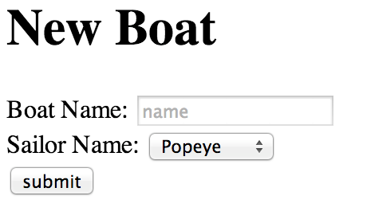
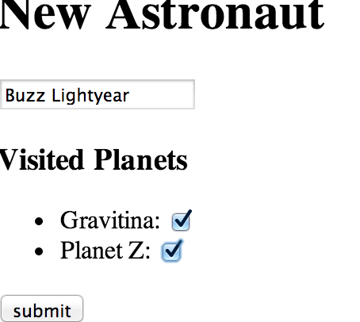

# Forms and Associations
One way to design forms is to think about model associations to help
drive the design of nested forms.

A form for creating a `SailBoat` that `belongs_to` a `Sailor`.



A form for creating an `Astronaut` that `has_many :visited_planets, through => :visits`



Now that we have an idea of what types of forms we would like to design, lets take
a closer look at the details per association type.

## `belongs_to`

Let's consider a case where we are writing a form `SailBoat`, which
`belongs_to :sailor`. When we create a `SailBoat`, we want to select a
`Sailor` that the boat belongs to:

```html+erb
<form action="<%= sail_boats_url %>" method="post">
  <input type="text" name="sail_boat[name]">

  <select name="sail_boat[sailor_id]">
    <% Sailor.all.each do |sailor| %>
      <option value="<%= sailor.id %>"><%= sailor.name %></option>
    <% end %>
  </select>

  <input type="submit">
</form>
```

The `select` box presents a drop-down of `Sailor`s to choose from. The
`id` of the `Sailor` will be uploaded for `sail_boat[sailor_id]`. The
sailor's name will be the value displayed to the user to choose from.

By default, the first `option` will be the one originally selected
when the form is rendered. You can add a blank item by adding a
hardcoded option:

```html+erb
<select name="sail_boat[sailor_id]">
  <option value=""></option>
  <% Sailor.all.each do |sailor| %>
    <!-- ... -->
  <% end %>
</select>
```

## `has_many :through`

`belongs_to` is easy. `has_many` is a little more difficult. Let's
consider an example where an `Astronaut` `has_many :visited_planets,
:through => :planet_visits`. When she signs up to the service, the
`Astronaut` wants to record the `Planet`s which she has visited:
she'll pick them from a list. When she submits the form, not only the
`Astronaut`, but also `PlanetVisit` records need to be created.

This is new to us: we need to write a form that creates two kinds of
objects: an `Astronaut` and some `PlanetVisit`s.

Here's the schema:

```ruby
class Astronaut < ActiveRecord::Base
  has_many(
    :planet_visits,
    :class_name => "PlanetVisit",
    :foreign_key => :astronaut_id,
    :primary_key => :id
  )

  has_many(
    :visited_planets,
    :through => :planet_visits,
    :source => :planet
  )
end

class PlanetVisit < ActiveRecord::Base
  belongs_to :astronaut
  belongs_to :planet
end

class Planet < ActiveRecord::Base
end
```

The key to writing this common type of form is that `has_many
:through`, in addition to giving us an `Astronaut#visited_planets`
method, also will add a `Astronaut#visited_planet_ids=`
method. Assigning to `visited_planet_ids` will cause objects in the
join table, `planet_visits`, to be created, linking the `Astronaut`
with the given `Planet`s.

(The [RailsGuides][rails-guides-assocs] go into detail about the many
methods that `has_many` will add to a model.)

[rails-guides-assocs]: http://guides.rubyonrails.org/association_basics.html#has_many-association-reference

Let's use the Rails console and see this in action:

```
1.9.3p194 :020 > earth = Planet.create!(:name => "Earth")
   (0.1ms)  begin transaction
  SQL (0.5ms)  INSERT INTO "planets" ("created_at", "name", "updated_at") VALUES (?, ?, ?)  [["created_at", Tue, 11 Jun 2013 21:55:30 UTC +00:00], ["name", "Earth"], ["updated_at", Tue, 11 Jun 2013 21:55:30 UTC +00:00]]
   (1.5ms)  commit transaction
 => #<Planet id: 5, name: "Earth", created_at: "2013-06-11 21:55:30", updated_at: "2013-06-11 21:55:30">
1.9.3p194 :021 > moon = Planet.create(:name => "Moon")
   (0.1ms)  begin transaction
  SQL (0.6ms)  INSERT INTO "planets" ("created_at", "name", "updated_at") VALUES (?, ?, ?)  [["created_at", Tue, 11 Jun 2013 21:55:38 UTC +00:00], ["name", "Moon"], ["updated_at", Tue, 11 Jun 2013 21:55:38 UTC +00:00]]
   (98.7ms)  commit transaction
 => #<Planet id: 6, name: "Moon", created_at: "2013-06-11 21:55:38", updated_at: "2013-06-11 21:55:38">
1.9.3p194 :022 > a = Astronaut.create!(:name => "Sally Ride")
   (0.1ms)  begin transaction
  SQL (0.5ms)  INSERT INTO "astronauts" ("created_at", "name", "updated_at") VALUES (?, ?, ?)  [["created_at", Tue, 11 Jun 2013 21:55:45 UTC +00:00], ["name", "Sally Ride"], ["updated_at", Tue, 11 Jun 2013 21:55:45 UTC +00:00]]
   (2.4ms)  commit transaction
 => #<Astronaut id: 4, name: "Sally Ride", created_at: "2013-06-11 21:55:45", updated_at: "2013-06-11 21:55:45">
1.9.3p194 :023 > a.visited_planet_ids = [earth.id, moon.id]
  Planet Load (0.3ms)  SELECT "planets".* FROM "planets" WHERE "planets"."id" IN (5, 6)
  Planet Load (0.2ms)  SELECT "planets".* FROM "planets" INNER JOIN "planet_visits" ON "planets"."id" = "planet_visits"."planet_id" WHERE "planet_visits"."astronaut_id" = 4
   (0.1ms)  begin transaction
  SQL (0.5ms)  INSERT INTO "planet_visits" ("astronaut_id", "created_at", "planet_id", "updated_at") VALUES (?, ?, ?, ?)  [["astronaut_id", 4], ["created_at", Tue, 11 Jun 2013 21:55:52 UTC +00:00], ["planet_id", 5], ["updated_at", Tue, 11 Jun 2013 21:55:52 UTC +00:00]]
  SQL (0.2ms)  INSERT INTO "planet_visits" ("astronaut_id", "created_at", "planet_id", "updated_at") VALUES (?, ?, ?, ?)  [["astronaut_id", 4], ["created_at", Tue, 11 Jun 2013 21:55:52 UTC +00:00], ["planet_id", 6], ["updated_at", Tue, 11 Jun 2013 21:55:52 UTC +00:00]]
   (2.0ms)  commit transaction
 => [5, 6]
```

Okay, let's write a form to take advantage of this method. The
traditional way to do this is to use HTML checkboxes:

```html+erb
<form action="<%= astronauts_url %>" method="post">
  <input type="text" name="astronaut[name]">

  <% Planet.all.each do |planet| %>
    <label>
      <input
        type="checkbox"
        name="astronaut[visited_planet_ids][]"
        value="<%= planet.id %>">
      <%= planet.name %>
    </label>
  <% end %>

  <input type="submit">
</form>
```

Let's talk this form out.

For each `Planet`, we present a checkbox. We wrap the label around the input
and planet name as an easy way to hook them up (rather than setting the `id`
and `for` attributes). The `value` of the input is the id of the planet.

Because the name of the input is `astronaut[visited_planet_ids][]` (ends with
an empty `[]`), all the selected checkboxes will be interpreted as an
array by Rails (per the Rails parameter conventions). So Rails will
interpret:

```ruby
{ "astronaut" => {
    "name" => "Sally Ride",
    "visited_planet_ids" => [
      "1",
      "2"
    ]
  }
}
```

In the `AstronautsController#create` action, if we write
`Astronaut.new(astronaut_params)` we will:

0. Set `astronaut.name = "Sally Ride"`
0. Set `astronaut.visited_planet_ids = ["1", "2"]`
0. This will cause `PlanetVisit` objects to be created to connect
   the new `Astronaut` with the two planets.

Note that we'll have to `permit` `:visited_planet_ids` within
the controller to avoid a mass-assignment error. We can mass-assign
`visited_planet_ids` even though it is not a database column. When we pass
`Astronaut.new` a params hash, ActiveRecord doesn't care whether the keys are DB
column names or not. It is happy enough to call the setter for each key that is passed in;
whether that is:

0. Generated by Rails because it is a DB column
0. Generated by Rails from an association
0. Generated by us; we can write arbitrary code to run in a
   setter. We did this when we wrote `User#password=` which set
   `User#password_digest` (remember?).
