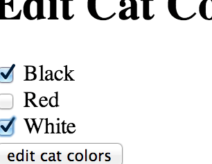

# Nested Forms II

## Removing Related Items

When we learned about checkboxes it was clear that to get a list of values into
a `POST` request we could use the format `cat[colors][]` and this would create
an array in the POST data `{ :cat => { :colors => ["white", "black"] }}`.

When we edit the list of colors later with a `PUT` request, the list of items
in the post data array will **replace** the items currently related to that
`Cat`.



You will find that if you have a form similar to the one above, that when you
uncheck all of the boxes they will not all reset. This is because if you
haven't selected any of the checkboxes, the post data will not contain the
colors array at all so it will not update the array to have 0 items.

```html
<form action="http://99cats.com/cats" method="post">
  <input type="hidden" name="_method" value="patch">
  <label>
    <input type="checkbox" name="cat[colors][]" value="black">
    Black
  </label>
  <br>

  <label>
    <input type="checkbox" name="cat[colors][]" value="red">
    Red
  </label>
  <br>

  <label>
    <input type="checkbox" name="cat[colors][]" value="white">
    White
  </label>
  <br>

  <input type="submit" value="Create cat">
</form>
```

To get around this we can add a hidden field with the name of the array and a
value of "". By adding `<input type="hidden" name="cat[colors][]" value="">`
our post will always have the `colors` array and if none of the checkboxes are
checked the post data will look like: `{:cat => { :colors => [] }}`. This will
remove all of the colors from the cats list of colors.
 

```html
<form action="http://99cats.com/cats" method="post">
  <input type="hidden" name="_method" value="patch">
  <!-- This is added to ensure we can uncheck all options -->
  <input type="hidden" name="cat[colors][]" value="">

  <label>
    <input type="checkbox" name="cat[colors][]" value="black">
    Black
  </label>
  <br>

  <label>
    <input type="checkbox" name="cat[colors][]" value="red">
    Red
  </label>
  <br>

  <label>
    <input type="checkbox" name="cat[colors][]" value="white">
    White
  </label>
  <br>

  <input type="submit" value="Create cat">
</form>
```

## Removing Objects

To remove an object, we can post a field with the name `_destroy`
and a truthy value and an id of the object to destroy. The HTML for a checkbox
list of things to destroy might look like:

```html
<input type="hidden" 
       name="addresses[<%= address.id %>][id]" value="<%= address.id %>">
<input type="checkbox" 
       name="addresses[<%= address.id %>][_destroy]" value="1">
```

If the hash of attributes for an object contains the key `_destroy` with
a value of '1' or 'true' then the object will be destroyed. This is
often done with a checkbox ("Delete?") which has a value of '0'/'false'
(unchecked) or '1'/'true' (checked).

```ruby
  @addresses = address_params.map do |address_data|
    unless address_data[:id].blank?
      address = Address.find(address_data[:id])

      # if the address has been submitted with the _destroy name and a truthy
      # value delete it
      address_data[:id] = "" # fake out persistence
      # we're faking this out for the all?(&:blank?) call below
      # if we omit the line above, the id will never be blank and we
      # will need to check each value for blankness individually
      if address_data.values.all?(&:blank?) || address_data[:_destroy]
        address.destroy
        next
      end

      # Soft `#update_attributes` will not raise rollback transaction
      address.update_attributes(address_data)
      address
    else
      Address.new(address_data)
    end
  end.compact # dump the nil ones.
```

[nested-forms-i]: https://github.com/appacademy/rails-curriculum/blob/master/w5d2/transaction.md

## Pre-Building Related Objects

When we're building nested forms it's common to present the user with a pre-
defined number of fields to fill in. This is how we could easily present 3 new
text fields for entering addresses.

```ruby
def new
  @user = User.new
  3.times { @user.addresses.build }
end
```
This will build associated address objects for the user that can be used to build the nested form as follows.

```html
<% @user.addresses.each do |address| %>
  <input name="addresses[<%= address.object_id %>][street]">
<% end %>
```
