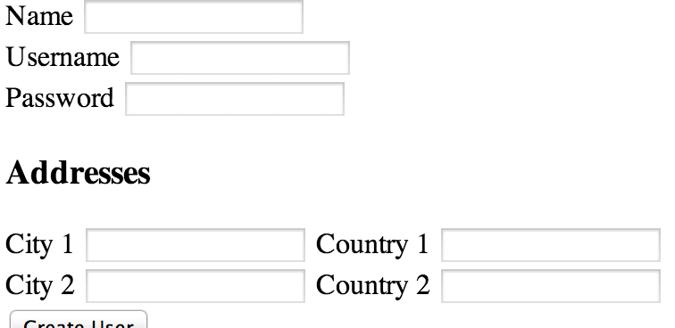

# Nested Forms

Let's say we have a `User` and that a `User` `has_many :addresses`
(an office address, a home address, etc.). An address in turn
`belongs_to` a `User`.

On the sign up form, we'd like the user to enter basic information
(name, username, password, etc.) as well as give them the opportunity
to enter multiple addresses. Like this:



We want to be able to create multiple objects in a single form. We've
done that in the context of join tables (`has_many :through`, remember
`Astronaut` and `Planet`?). But those were simple objects that just
contained a pair of ids. How do we build an associated object with
more attributes than just a pair of ids?

## Nested HTML Forms
An HTML Form that could be used to enter a users name, username, password and multiple related addresses.

```html
<form action="<%= users_url %>" method="post">
  <label>
    Name
    <input type="text" name="user[name]" value="<%= @user.name %>">
  </label>
  <label>
    Username
    <input type="text" name="user[username]" value="<%= @user.username %>">
  </label>

  <label>
     Password
     <input type="password" name="user[password]" value="<%= @user.password %>"> 
  </label>

  <!-- Two addresses entered during signup. -->
  <label>
    City 1
    <!-- Notice that the 'name' includes an additional key [1] -->
    <input type="text" name="addresses[1][city]">
  </label>
  <label>
    Country 1
    <input type="text" name="addresses[1][country]">
  </label>

  <label>
    City 2
    <input type="text" name="addresses[2][city]">
  </label>
  <label>
    Country 2
    <input type="text" name="addresses[2][country]">
  </label>

  <input type="submit" value="Create User">
</form>
```

So the user has entered user data as well as address data.
There are two issues we'll have to tackle: first, we need to
properly extract and permit the address data, and second,
we need to ensure that the user and the addresses are saved
together.

## Extracting and Permitting Nested Data

If the above form were to be submitted, the incoming params
hash would look something like this:

```ruby
{
  "user" => {
    "name" => "Jim",
    "username" => "Jimbo",
    "password" => [FILTERED]
  },
  "addresses" => {
    "0" => {
      "city" => "Buenos Aires",
      "country" => "Argentina"
    },
    "1" => {
      "city" => "Kansas City",
      "country" => "USA"
    }
  }
}
```

Extracting the user data is straightforward:

```ruby
def user_params
  params.require(:user).permit(:name, :username, :password)
end
```

The address data is a little bit trickier. What we'd like to
do permit the attributes of the nested hashes (nested under "0" and "1"):

```ruby
# In UsersController

# Here we permit the :city and :country keys nested under the
# :addresses key, and then require and return the addresses.
# Note that we can ignore the '0', '1', ... dummy keys in the permit.

def address_params
  params.permit(:addresses => [:city, :country])
        .require(:addresses)
        .values
end
```

Take a look at 
[`strong_parameters`'s documentation on nested attributes][strong-parameters-nested].

Now that we have extracted and permitted our user and address
data, we'll move on to saving that data.

[strong-parameters-nested]: https://github.com/rails/strong_parameters#nested-parameters


## Saving Associated Objects

Here, we'd like to save both the user and the addresses. Let's assume the
addresses have a `user_id` attribute that we'd like to set, but since we're
creating the user  simulatneously, we don't have the id until the user is
saved.

What we'd like to do is save the user and the addresses in a transaction
(either everything saves or nothing does - more on the topic below), saving the
user first and assigning the user's id to each of the new addresses. Let's see
how that might look if we did it manually (we'll see later that Rails has a
much nicer way of doing the same for us):

**Incorrect**
```ruby
def create
  begin
    @user = User.new(user_params)

    User.transaction do
      @user.save!
      address_params.each do |address|
        address = Address.new(address)
        address.user_id = @user.id
        address.save!
      end
    end

    redirect_to user_url(@user)
  rescue ActiveRecord::RecordInvalid
    flash.now[:errors] = @user.errors.full_messages
    render :new
  end
end
```

This gets the job done, but there's a disadvantage to this  manual approach: if
the transaction fails because of an error in one of the addresses, the errors
don't get sent back (only the user errors are sent). We could build in
additional logic to handle that, but it's gotten hairy enough that we'll just
show you the cleaner Rails Way.

## The True Path
```ruby
def create
  @user = User.new(user_params)

  # The `new` method on an association can take an array of hashes
  # to instantiate multiple objects at once.

  @user.addresses.new(address_params)

  if @user.save
    redirect_to user_url(@user)
  else
    flash.now[:errors] = @user.errors.full_messages
    render :new
  end
end
```

Ah, much nicer. By building the addresses through the user, not only are all
the objects saved in a transaction, but the addresses automatically get their
`user_id` (the `foreign_key` on the `has_many` association we're building 
through) set to the newly created user's id. This is one of the many benefits
of Rails associations. See the [RailsGuide on Associations][rails-guide-assoc] 
for more.

[rails-guide-assoc]: http://guides.rubyonrails.org/association_basics.html#has-many-association-reference

We can actually see this in console. As before, a `User` `has_many`
`addresses`, and we're validating the presence of `city`, `state`, and
`street`.

```ruby
@user = User.new(name: "Sid")
=> #<User id: nil, name: "Sid", created_at: nil, updated_at: nil>

@user.addresses.new(street: "Broadway", city: "New York", state: "NY")
=> #<Address id: nil, user_id: nil, street: "Broadway", city: "New York", state: "NY", created_at: nil, updated_at: nil>

@user.save
   (0.3ms)  BEGIN
   SQL (15.6ms)  INSERT INTO "users" ("created_at", "name", "updated_at") VALUES ($1, $2, $3) RETURNING "id"  [["created_at", Wed, 25 Sep 2013 20:29:46 UTC +00:00], ["name", "Sid"], ["updated_at", Wed, 25 Sep 2013 20:29:46 UTC +00:00]]

   SQL (1.4ms)  INSERT INTO "addresses" ("city", "created_at", "state", "street", "updated_at", "user_id") VALUES ($1, $2, $3, $4, $5, $6) RETURNING "id"  [["city", "New York"], ["created_at", Wed, 25 Sep 2013 20:29:46 UTC +00:00], ["state", "NY"], ["street", "Broadway"], ["updated_at", Wed, 25 Sep 2013 20:29:46 UTC +00:00], ["user_id", 1]]
   (0.6ms)  COMMIT
=> true
```
Hooray! Everything was saved!

If an address fails validation, the `@user` won't be saved either:

```ruby
@user = User.new(name: "Jonathan")
=> #<User id: nil, name: "Jonathan", created_at: nil, updated_at: nil>

@user.addresses.new(city: "New York", state: "NY")
=> #<Address id: nil, user_id: nil, street: nil, city: "New York", state: "NY", created_at: nil, updated_at: nil>

@user.save
   (0.2ms)  BEGIN
   (0.2ms)  ROLLBACK
=> false

@user.persisted?
=> false
```

## Rejecting Blank Associated Objects

In the example above, the form provided to the user gave them the option
of creating multiple associated addresses. We may want to allow the user to
fill in only a subset of them, or none. In this case, we need to make sure
to discard the addresses that are all blank. We can easily do so by slightly
altering our `address_params` method:

```
def address_params
  params.permit(:addresses => [:city, :country])
        .require(:addresses)
        .values
        .reject { |data| data.values.all?(&:blank?) }
end
```

By chaining the `reject` method, we ensure that we attempt to save only those
addresses that have some data in them.

## Transactions

[Transactions][arbase-transaction] are built to be all or nothing. If any
single part of the transaction fails all of the changes inside that transaction
are rolled back. Transactions should be used when you want to either execute
all of the statements or none at all.

The canonical transaction example is when David is paying Mary 100. If we try
to withdraw 100 from David, and any error occurs, then we should not pay Mary
100. Likewise, when we're paying Mary 100 and any error occurs we should return
rollback the withdrawal transaction from David's account.

```ruby
ActiveRecord::Base.transaction do
  david.withdrawal(100)
  mary.deposit(100)
end
```

Yup -- we can initiate our own transactions with
`ActiveRecord::Base.transaction` (or any class that inherits, i.e. any model)!
If any of the saves inside the block given to our `transaction` fail,
everything inside the block will be rolled back.

When would we want to write our own transactions? If we're trying to save
several related models, we can use the trick mentioned above, i.e. scope one
object through the other (like we scoped `address` through `user`) and then
save the parent. Initiating our own transactions is useful if the models we're
trying to make __are not__ related. When the models aren't related, we can't
use our scoping trick, so we need to use `ActiveRecord::Base.transaction` if we
want to ensure we have an all or none saving behavior. Explicit transactions
are also useful if you want to create a specific number of objects, and not
less.

Let's say we want to create several `Address` objects at the same time. The
`create` action in our controller might look like this:

```ruby
def create
  begin
    Address.transaction do
      # Here, we feed create! an array of address hashes;
      # if any of them fail, Rails will raise ActiveRecord::RecordInvalid
      # causing the transaction to be rolled back. We then catch the error
      # below.
      @addresses = Address.create!(address_params)
    end
  rescue ActiveRecord::RecordInvalid
    flash.now[:errors] = "One or more address was invalid!"
    render :new
  else
    redirect_to user_url(@user)
  end
end
```

You might say, "But wait! We can just feed the `create` method of any model an
array of parameters, and it will make a record for each one!" This is true, but
it is __not__ all or nothing. Observe (we're validating the presence of
`state`):

```ruby
Address.create([{city: "NY", state: "NY", street: "Broadway"},{city: "SF"}])
   (0.1ms)  BEGIN
   SQL (0.6ms)  INSERT INTO "addresses" ("city", "created_at", "state", "street", "updated_at", "user_id") VALUES ($1, $2, $3, $4, $5, $6) RETURNING "id"  [["city", "NY"], ["created_at", Thu, 26 Sep 2013 13:37:25 UTC +00:00], ["state", "NY"], ["street", "Broadway"], ["updated_at", Thu, 26 Sep 2013 13:37:25 UTC +00:00], ["user_id", nil]]
   (6.8ms)  COMMIT
   (0.2ms)  BEGIN
   (0.2ms)  ROLLBACK

=> [#<Address id: 6, user_id: nil, street: "Broadway", city: "NY", state: "NY", created_at: "2013-09-26 13:37:25", updated_at: "2013-09-26 13:37:25">, #<Address id: nil, user_id: nil, street: nil, city: "SF", state: nil, created_at: nil, updated_at: nil>]

Address.last
  Address Load (0.4ms)  SELECT "addresses".* FROM "addresses" ORDER BY "addresses"."id" DESC LIMIT 1
=> #<Address id: 6, user_id: nil, street: "Broadway", city: "NY", state: "NY", created_at: "2013-09-26 13:37:25", updated_at: "2013-09-26 13:37:25">
```

The first was persisted, while the second wasn't.

## Exceptions

Keep in mind that exceptions thrown inside of the transaction block will be
propagated. One exception to that rule is the ActiveRecord::Rollback exception
which, if raised inside of the transaction will cause a rollback, but will not
be propogated beyond the transaction block.

## References

* [ActiveRecord::Base.transaction][arbase-transaction]
* [Rails API on `accepts_nested_attributes_for`][rails-api-nested]
* [RailsCast on nested forms][railscast-nested]

[railscast-nested]: http://railscasts.com/episodes/196-nested-model-form-revised?view=asciicast
[rails-api-nested]: http://api.rubyonrails.org/classes/ActiveRecord/NestedAttributes/ClassMethods.html
[arbase-transaction]: http://api.rubyonrails.org/classes/ActiveRecord/Transactions/ClassMethods.html
